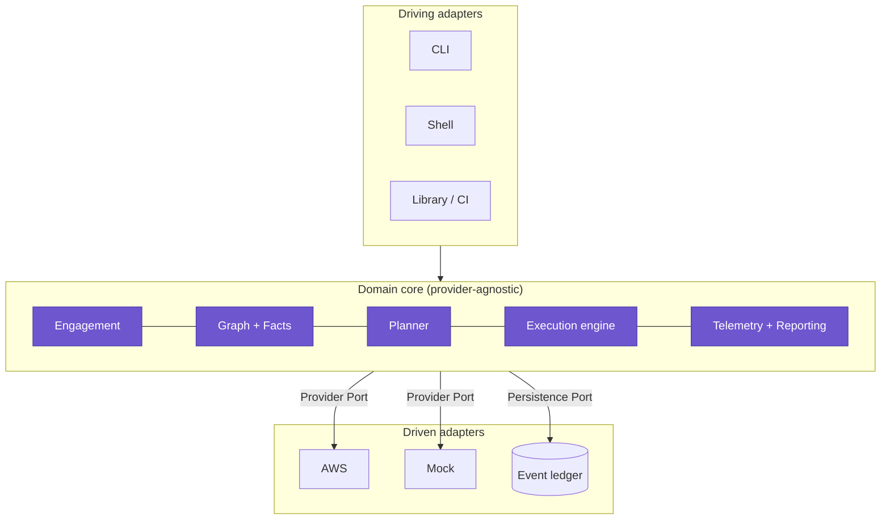

<div align="center">


# Akumo

### 悪雲 — offense-minded security for the cloud

**A multi-cloud-ready, attack-graph-native offensive framework that unifies _discovery_, _attack-path reasoning_, and _safe execution_ into one loop.**

<br/>

[](https://github.com/BlueSquadron/Akumo/actions/workflows/ci.yml)
[](https://github.com/BlueSquadron/Akumo/releases)
[](LICENSE)
[](https://www.rust-lang.org)
[](#-install)
[](https://attack.mitre.org/matrices/enterprise/cloud/)
[](CONTRIBUTING.md)

<a href="#-quickstart"><b>Quickstart</b></a> ·
<a href="#-demo"><b>Demo</b></a> ·
<a href="docs/external/"><b>Write techniques</b></a> ·
<a href="#-how-it-works"><b>How it works</b></a> ·
<a href="#️-roadmap"><b>Roadmap</b></a>

</div>

---

> ### ⚠️ Authorized use only
> Akumo is offensive tooling for infrastructure you are **authorized to test** — owned accounts,
> contracted engagements, and lab/CTF environments. Authorization gating, scope enforcement,
> reversibility, and an evidence-grade audit trail are **enforced requirements, not features**.

**Akumo** fuses **Akuma** (悪魔, _"devil"_) and **Kumo** (雲, _"cloud"_) — a devil for the cloud, on
your side. Today's operator stitches four tools together by hand: a scanner finds misconfigurations,
a path-enumerator surfaces routes, an exploitation framework acts, and a detonation tool validates
detections — across four incompatible data models. **Akumo closes that seam**: it enumerates the
_real_ target into an attack graph, computes _explainable_ paths toward an objective, and **safely
executes** them with automatic revert — emitting, for every action, its purple-team detection
signature.

---

## 📑 Table of contents

- [Why Akumo](#-why-akumo)
- [Features](#-features)
- [Install](#-install)
- [Quickstart](#-quickstart)
- [Demo](#-demo)
- [How it works](#-how-it-works)
- [Writing techniques](#️-writing-techniques)
- [Safety model](#️-safety-model)
- [How Akumo compares](#-how-akumo-compares)
- [Documentation](#-documentation)
- [Roadmap](#️-roadmap)
- [Contributing](#-contributing) · [Security](#-security) · [License](#-license)

---

## 🌩️ Why Akumo

The cloud-offense field splits into quadrants — and almost every tool does **one** well:

|            | **Find** (discover / enumerate) | **Act** (execute / detonate) |
|------------|---------------------------------|------------------------------|
| **Read-only / posture** | Prowler, ScoutSuite           | Grimoire (detection datasets) |
| **Offensive / action**  | CloudFox (finds paths, stops)  | Pacu (AWS), Stratus (synthetic) |

The seam between **"discover a real path"** and **"safely execute it against the real environment"**
is where the field is weakest — and where Akumo lives. It takes the best pattern from each and
unifies them behind **one data model** and **one safety guarantee**.

---

## ✨ Features

- 🧭 **Attack-graph-native.** Models the environment as an identity + resource + trust graph and
  **computes** ranked, reachable privesc/lateral paths — it doesn't just run hand-authored scripts.
- 🎯 **Objective-seeking.** State a goal (_"reach admin"_, _"reach this resource"_); Akumo finds and
  explains the path — every hop annotated with the enabling permission and its certainty.
- 🛟 **Safe by construction.** Dry-run + blast-radius preview, impact-gated consent, and a
  **transactional saga revert** that undoes only what happened — restart-safe, on real targets.
- 🧾 **Declarative, testable techniques.** YAML + a safe expression language (CEL-aligned), MITRE-
  mapped, with a **mandatory, tested revert contract**. Escape to Starlark/WASM per-step when needed.
- 🕵️ **Purple-team dual output.** Every action ships its **expected telemetry** as a Sigma-aligned
  candidate detection — offense that teaches defense.
- 🧱 **Provider-neutral core, AWS today.** A single provider seam; AWS is the first adapter, the Mock
  is the second — proving new providers are _additive, never a rewrite_ (CI-enforced).
- 📜 **Evidence-grade.** An append-only, **hash-chained** ledger is the single source of truth;
  reports (Markdown/JSON) and STIX / MITRE Attack Flow exports are folded from it.
- 📦 **Single static binary.** One low-friction executable; interactive CLI **and** an optional shell
  **and** a CI-native non-interactive mode.

---

## 🧰 Install

```bash
# Homebrew (tap)
brew install BlueSquadron/akumo/akumo

# Docker
docker run --rm ghcr.io/bluesquadron/akumo:latest --help

# From source (Rust stable)
git clone https://github.com/BlueSquadron/Akumo && cd Akumo/code
cargo build --release && ./target/release/akumo --version
```

Prebuilt, signed binaries for Linux & macOS are attached to every [release](https://github.com/BlueSquadron/Akumo/releases).

---

## 🚀 Quickstart

```console
# 1. Who am I, and where can I operate?  (no changes, no enumeration)
$ akumo authcheck
principal: arn:aws:iam::123456789012:user/pentester
provider:  aws
regions:   us-east-1

# 2. Open an authorized, scoped engagement  (the affirmation is recorded)
$ akumo engagement open --id acme-q3 --scope account:123456789012 --affirm
opened engagement acme-q3

# 3. Enumerate the target into the attack graph
$ akumo enumerate --engagement acme-q3 --descriptor iam.ListUsers --descriptor iam.ListRoles
enumerated 2 descriptor(s): 214 facts, 3 coverage gap(s)
```

Start on `--provider mock` (a built-in practice target) before pointing at real AWS.

---

## 🎬 Demo

A representative engagement — from a foothold to admin, executed and reverted, output shape matches
the real CLI:

```console
$ akumo paths --engagement acme-q3 --objective admin
--- path 1 ---
1. arn:…:user/pentester --[can-assume: sts:AssumeRole]--> control arn:…:role/ci-deploy (Proven)
2. arn:…:role/ci-deploy --[technique aws.iam.privesc.attach-user-policy]--> control arn:…:role/admin (Proven)
confidence: Proven · reversible: true · max impact: mutating-reversible

$ akumo preview --engagement acme-q3 --technique aws.iam.privesc.attach-user-policy --input user=ci-deploy
technique:      aws.iam.privesc.attach-user-policy
impact:         mutating-reversible (reversible: true)
provider calls: iam.AttachUserPolicy
effects:        has_permission(ci-deploy, AdministratorAccess)

$ akumo run --engagement acme-q3 --technique aws.iam.privesc.attach-user-policy --input user=ci-deploy --consent
status: Completed — 1 step(s) detonated, 1 verified

$ akumo revert --engagement acme-q3
reverted 1 step(s); 0 could not be undone

$ akumo report --engagement acme-q3 --format md | head -n 12
# Akumo Engagement Report — acme-q3
## Executive summary
- Provider: aws
- Status: open
- Attack paths computed: 1
- Techniques exercised: 1
- Steps detonated / reverted: 1 / 1
- MITRE ATT&CK coverage: T1098
```

> An optional interactive shell (`akumo shell`) layers the same commands over the persistent ledger —
> no session state to lose.

---

## 🧠 How it works

Akumo runs one loop, over one data model:


Everything is recorded to an append-only, hash-chained **event ledger** — the graph, execution
status, loot, and reports are all deterministic projections of it. The design is **hexagonal**: a
provider-blind core, adapters at the edges.



The core depends only on **ports**; the AWS SDK lives solely in the AWS adapter — a lint fails CI if
that ever leaks. Read the full design under [`docs/internal/`](docs/internal/) and the decision log
in [`spec/ADR/`](spec/ADR/).

---

## ✍️ Writing techniques

Techniques are **data, not code you must trust** — declarative YAML, versioned, validated, always with
a revert:

```yaml
metadata:
  id: aws.iam.persistence.create-access-key
  name: Create IAM Access Key
  mitre: ["T1098"]
  impact: mutating-reversible
  expected_telemetry:
    - { source: cloudtrail, event_name: CreateAccessKey }
contract:
  inputs: [{ name: user, type: principal, required: true }]
  effects: [{ predicate: { name: has_credential, args: ["$user", "new-access-key"] } }]
steps:
  - id: create
    body: { type: call, service: iam, operation: CreateAccessKey, params: { UserName: "$user" } }
    bind: [{ name: key_id, from: result.AccessKeyId }]
    revert: { service: iam, operation: DeleteAccessKey, params: { UserName: "$user", AccessKeyId: "$key_id" } }
```

The **contract** (preconditions/effects) is what lets the planner chain your technique into an attack
path automatically. Learn it step by step in the **progressive guide**:
[**Getting Started → Advanced**](docs/external/) (install → run → author → CEL → chaining → revert →
Starlark/WASM → detections → bundles).

---

## 🛡️ Safety model

| Guarantee | How |
|---|---|
| **Least blast radius by default** | read-only unless you elevate; nothing above `read` runs without recorded consent |
| **Reversible by construction** | every mutating technique ships a **tested** revert; no passing test ⇒ it doesn't ship |
| **Transactional revert** | saga compensations replayed in reverse; undoes only what happened; **restart-safe** |
| **Scoped & fail-closed** | out-of-scope targets are refused and logged; a global kill-switch halts + reverts |
| **Honest under partial access** | "unknown ≠ absent" — blind spots are recorded, uncertain paths labeled, never hidden |
| **Evidence-grade** | append-only, **hash-chained**, tamper-evident ledger; reproducible reports |

---

## 📊 How Akumo compares

| Capability | Pacu | Stratus | CloudFox | **Akumo** |
|---|:--:|:--:|:--:|:--:|
| Executes real attacks | ✅ | ⚠️ synthetic | ❌ | ✅ |
| Attack-path discovery | ❌ | ❌ | ✅ | ✅ |
| Objective-seeking | ❌ | ❌ | ❌ | ✅ |
| Safe revert / rollback | ❌ | ✅ | n/a | ✅ (real targets) |
| MITRE + telemetry output | ❌ | ✅ | ⚠️ | ✅ |
| Declarative, tested content | ❌ | ⚠️ Go | ❌ | ✅ YAML+CEL |
| Single binary | ❌ Py | ✅ | ✅ | ✅ Rust |

<sub>Summarized from the prior-art analysis in [`spec/Analysis.md`](spec/Analysis.md).</sub>

---

## 📚 Documentation

| For | Start here |
|---|---|
| 🧑‍💻 **Operators & authors** | [`docs/external/`](docs/external/) — a beginner→advanced ladder |
| 🛠️ **Contributors & maintainers** | [`docs/internal/`](docs/internal/) — architecture → components → testing |
| 🧩 **Design & decisions** | [`spec/`](spec/) — analysis, requirements, specification, and 31 ADRs |
| ✅ **What "done" means** | [`docs/internal/22-v1-done.md`](docs/internal/22-v1-done.md) |

---

## 🗺️ Roadmap

**v1 (this release):** AWS provider · attack graph + deterministic planner · safe execution + saga
revert · YAML+CEL techniques · Sigma detections · reports + STIX export · CLI + shell.

**v2 (tracked in [`spec/V2_BACKLOG.md`](spec/V2_BACKLOG.md)):** Azure / GCP / Kubernetes adapters ·
identity-plane & cross-provider paths · AI-assisted planner (advisory, human-gated) · live telemetry
correlation · external posture ingestion · attack-graph visualization.

---

## 🤝 Contributing

PRs and new techniques are welcome — adding a technique is additive (drop a YAML file). See
[`CONTRIBUTING.md`](CONTRIBUTING.md) and the [Code of Conduct](CODE_OF_CONDUCT.md). Every mutating
technique needs a passing detonate-and-revert test.

## 🔒 Security

Found a vulnerability **in Akumo itself**? Please follow [`SECURITY.md`](SECURITY.md) (private
disclosure). Do not use Akumo against systems you aren't authorized to test.

## 📜 License

Licensed under [Apache-2.0](LICENSE).

## 🙏 Acknowledgements

Akumo stands on the shoulders of the field — **Pacu** (Rhino Security Labs), **Stratus Red Team** &
**Grimoire** (Datadog), **CloudFox** (Bishop Fox), **Prowler**, **ScoutSuite**, and the
[AWS Threat Technique Catalog](https://aws-samples.github.io/threat-technique-catalog-for-aws/matrix.html).
Classification aligns to [MITRE ATT&CK](https://attack.mitre.org/matrices/enterprise/cloud/); chains
export to [MITRE Attack Flow](https://ctid.mitre.org/projects/attack-flow/).

<div align="center"><sub>Built with 🦀 and a healthy respect for blast radius. If Akumo is useful, consider giving it a ⭐.</sub></div>
