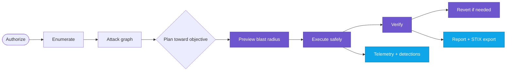
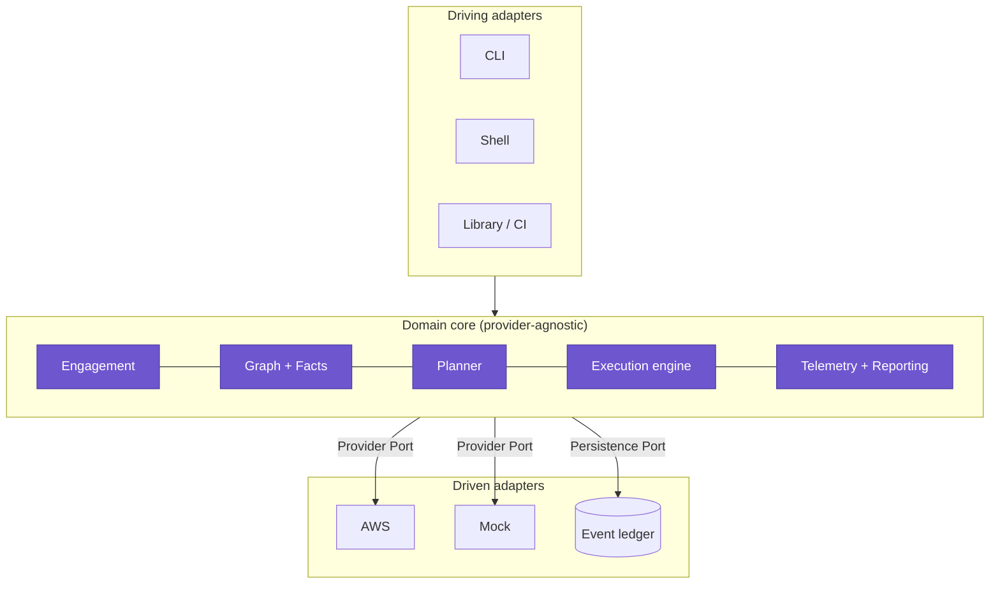

<div align="center">


# Akumo

### 悪雲 — offense-minded security for the cloud

**A multi-cloud-ready, attack-graph-native offensive framework that unifies _discovery_, _attack-path reasoning_, and _safe execution_ into one loop. v1 targets AWS behind a provider-neutral core.**

<br/>

[](https://github.com/BlueSquadron/Akumo/actions/workflows/ci.yml)
[](LICENSE)
[](https://www.rust-lang.org)
[](#-install)
[](https://attack.mitre.org/matrices/enterprise/cloud/)
[](CONTRIBUTING.md)

<a href="#-quickstart-mock-provider"><b>Quickstart</b></a> ·
<a href="docs/external/"><b>Write techniques</b></a> ·
<a href="#-how-it-works"><b>How it works</b></a> ·
<a href="#-status"><b>Status</b></a> ·
<a href="#️-roadmap"><b>Roadmap</b></a>

</div>

---

> ### ⚠️ Authorized use only
> Akumo is offensive tooling for infrastructure you are **authorized to test** — owned accounts,
> contracted engagements, and lab/CTF environments. Authorization gating, scope enforcement,
> reversibility, and an evidence-grade audit trail are **enforced requirements, not features**.

**Akumo** fuses **Akuma** (悪魔, _"devil"_) and **Kumo** (雲, _"cloud"_) — a devil for the cloud, on
your side. Today's operator stitches four tools together by hand: a scanner finds misconfigurations,
a path-enumerator surfaces routes, an exploitation framework acts, and a detonation tool validates
detections — across four incompatible data models. **Akumo closes that seam**: it enumerates the
target into an attack graph, computes _explainable_ paths toward an objective, and **safely executes**
them with automatic revert — emitting, for every action, its purple-team detection signature.

---

## 📑 Table of contents

- [Why Akumo](#-why-akumo)
- [Features](#-features)
- [Install](#-install)
- [Quickstart (Mock provider)](#-quickstart-mock-provider)
- [How it works](#-how-it-works)
- [Writing techniques](#️-writing-techniques)
- [Safety model](#️-safety-model)
- [How Akumo compares](#-how-akumo-compares)
- [Status](#-status)
- [Documentation](#-documentation)
- [Roadmap](#️-roadmap)
- [Contributing](#-contributing) · [Security](#-security) · [License](#-license)

---

## 🌩️ Why Akumo

The cloud-offense field splits into quadrants — and almost every tool does **one** well:

|            | **Find** (discover / enumerate) | **Act** (execute / detonate) |
|------------|---------------------------------|------------------------------|
| **Read-only / posture** | Prowler, ScoutSuite           | Grimoire (detection datasets) |
| **Offensive / action**  | CloudFox (finds paths, stops)  | Pacu (AWS), Stratus (synthetic) |

The seam between **"discover a real path"** and **"safely execute it against the real environment"**
is where the field is weakest — and where Akumo lives. It takes the best pattern from each and unifies
them behind **one data model** and **one safety guarantee**.

---

## ✨ Features

- 🧭 **Attack-graph-native.** Models the environment as an identity + resource + trust graph and
  **computes** ranked, reachable privesc/lateral paths — it doesn't just run hand-authored scripts.
- 🎯 **Objective-seeking.** State a goal (_reach admin_, _reach a resource_); Akumo finds and explains
  the path — every hop annotated with the enabling permission and its epistemic status.
- 🛟 **Safe by construction.** Static dry-run + blast-radius preview, impact-gated consent, and a
  **transactional saga revert** that undoes only what happened — restart-safe.
- 🧾 **Declarative, testable techniques.** YAML + a safe, self-contained expression language
  (CEL-aligned), MITRE-mapped, with a **mandatory, tested revert contract**. A per-step escape-hatch
  **seam** for Starlark/WASM is in place (the runtimes themselves are on the [roadmap](#️-roadmap)).
- 🕵️ **Purple-team dual output.** Every technique carries its **expected telemetry**, generated as a
  Sigma-aligned candidate detection — offense that teaches defense.
- 🧱 **Provider-neutral core.** A single provider seam; **AWS** is the first adapter and a built-in
  **Mock** is the second — proving new providers are _additive, never a rewrite_ (CI-enforced).
- 📜 **Evidence-grade.** An append-only, **hash-chained** ledger is the single source of truth; reports
  (Markdown / JSON) and STIX / MITRE Attack Flow exports are folded from it.
- 💻 **One binary, three modes.** An interactive CLI, an optional shell, and a non-interactive mode for
  CI — all over the same persistent ledger.

---

## 🧰 Install

There are **no published packages or release binaries yet** — build from source (Rust stable):

```bash
git clone https://github.com/BlueSquadron/Akumo && cd Akumo/code
cargo build --release
./target/release/akumo --version
```

A container image can be built from the included `Dockerfile`:

```bash
docker build -t akumo:dev .
docker run --rm akumo:dev --help
```

> Signed static binaries (Linux/macOS) and a GHCR container image are produced by the release workflow
> (`.github/workflows/release.yml`) **when a release is tagged** — none has been published yet.

---

## 🚀 Quickstart (Mock provider)

The default `--provider mock` is a built-in, cloud-free practice target — no credentials required.
These commands run as shown against a fresh build (from the repo root, using the built binary):

```console
$ akumo authcheck
principal: arn:aws:iam::000000000000:user/akumo-operator
provider:  mock
regions:   mock-region-1

$ akumo engagement open --id demo --scope account:123456789012 --affirm
opened engagement demo

$ akumo catalog --content code/content
aws.cloudtrail.defense-evasion.stop-logging  [mutating-reversible]  aws  — Stop CloudTrail Logging
aws.iam.persistence.create-access-key  [mutating-reversible]  aws  — Create IAM Access Key
aws.iam.persistence.create-user  [mutating-reversible]  aws  — Create IAM User
aws.iam.persistence.create-login-profile  [mutating-reversible]  aws  — Create Console Login Profile
aws.iam.privesc.attach-user-policy  [mutating-reversible]  aws  — Attach Managed Policy to User

$ akumo preview --engagement demo \
    --technique aws.iam.persistence.create-access-key \
    --content code/content --input user=alice
technique:    aws.iam.persistence.create-access-key
impact:       mutating-reversible (reversible: true)
provider calls: iam.CreateAccessKey
effects:      has_credential($user, new-access-key)
```

`akumo technique --id <id> --content code/content` prints a technique's metadata **and** its generated
Sigma candidate detection. `akumo shell` layers the same commands over the persistent ledger.

> **The full loop** — `enumerate → plan → execute → verify → revert → report` — is exercised
> end-to-end by the test suite against the Mock (`cargo test -p akumo-core`). Executing it against a
> real target requires the AWS provider and credentials; see [Status](#-status) for exactly what the
> AWS adapter implements today.

---

## 🧠 How it works

Akumo runs one loop, over one data model:



Everything is recorded to an append-only, hash-chained **event ledger** — the graph, execution status,
loot, and reports are all deterministic projections of it. The design is **hexagonal**: a
provider-blind core, adapters at the edges.



The core depends only on **ports**; the AWS SDK lives solely in the AWS adapter — a lint
(`cargo run -p xtask -- dep-lint`) fails CI if that ever leaks. Full design under
[`docs/internal/`](docs/internal/); decision log in [`spec/ADR/`](spec/ADR/).

---

## ✍️ Writing techniques

Techniques are **data, not code you must trust** — declarative YAML, versioned, validated, always with
a revert. This is a real technique shipped in [`code/content/`](code/content/):

```yaml
metadata:
  id: aws.iam.persistence.create-access-key
  name: Create IAM Access Key
  mitre: ["T1098"]
  impact: mutating-reversible
  expected_telemetry:
    - { source: cloudtrail, event_name: CreateAccessKey }
contract:
  inputs: [{ name: user, type: principal, required: true }]
  effects: [{ predicate: { name: has_credential, args: ["$user", "new-access-key"] } }]
steps:
  - id: create
    body: { type: call, service: iam, operation: CreateAccessKey, params: { UserName: "$user" } }
    bind: [{ name: key_id, from: result.AccessKeyId }]
    revert: { service: iam, operation: DeleteAccessKey, params: { UserName: "$user", AccessKeyId: "$key_id" } }
```

The **contract** (preconditions/effects) is what lets the planner chain your technique into an attack
path automatically. Learn it step by step in the **progressive guide**,
[Getting Started → Advanced](docs/external/).

---

## 🛡️ Safety model

| Guarantee | How |
|---|---|
| **Least blast radius by default** | read-only unless you elevate; nothing above `read` runs without recorded consent |
| **Reversible by construction** | every mutating technique ships a **tested** revert; no passing test ⇒ it doesn't ship |
| **Transactional revert** | saga compensations replayed in reverse; undoes only what happened; **restart-safe** |
| **Scoped & fail-closed** | out-of-scope targets are refused and logged; a global kill-switch halts + reverts |
| **Honest under partial access** | "unknown ≠ absent" — blind spots are recorded, uncertain paths labeled, never hidden |
| **Evidence-grade** | append-only, **hash-chained**, tamper-evident ledger; reproducible reports |

Each of these is a release-blocking, tested gate (`akumo-core::gates`).

---

## 📊 How Akumo compares

A capability-presence comparison, summarized from the prior-art analysis in
[`spec/Analysis.md`](spec/Analysis.md):

| Capability | Pacu | Stratus | CloudFox | **Akumo v1** |
|---|:--:|:--:|:--:|:--:|
| Executes real attacks | ✅ | ⚠️ synthetic | ❌ | ✅ &nbsp;<sup>†</sup> |
| Attack-path discovery | ❌ | ❌ | ✅ | ✅ |
| Objective-seeking | ❌ | ❌ | ❌ | ✅ |
| Safe revert / rollback | ❌ | ✅ | n/a | ✅ (real targets) |
| MITRE + telemetry output | ❌ | ✅ | ⚠️ | ✅ |
| Declarative, tested content | ❌ | ⚠️ Go | ❌ | ✅ YAML+CEL |
| Single binary | ❌ Py | ✅ | ✅ | ✅ Rust |

<sup>†</sup> The mechanism is complete; the shipped AWS **technique/action coverage is a starter set**
(see [Status](#-status)) and grows additively behind the seam.

---

## 📋 Status

Akumo v1 is feature-complete for its scope; coverage is deliberately a **starter set** you extend.

- ✅ **Implemented:** provider-neutral core; event-sourced ledger; enumeration → attack graph;
  deterministic planner (reach-admin / reach-resource); YAML+CEL technique model with saga revert;
  Sigma detection generation; reports + STIX/Attack Flow export; CLI + shell; **Mock** provider; and
  an **AWS** adapter covering **STS identity, IAM user/role enumeration, and the
  create/delete-access-key action pair**.
- 🌱 **Starter content:** 5 reversible AWS techniques across persistence / privesc / defense-evasion.
- 🚧 **Not yet wired (see [Roadmap](#️-roadmap)):** Starlark/WASM escape-hatch runtimes (seam only);
  broader AWS action coverage; live-AWS integration tier (release-gated); published packages.

What "done" means, with the test proving each capability, is in
[`docs/internal/22-v1-done.md`](docs/internal/22-v1-done.md).

---

## 📚 Documentation

| For | Start here |
|---|---|
| 🧑‍💻 **Operators & authors** | [`docs/external/`](docs/external/) — a beginner→advanced ladder |
| 🛠️ **Contributors & maintainers** | [`docs/internal/`](docs/internal/) — architecture → components → testing |
| 🧩 **Design & decisions** | [`spec/`](spec/) — analysis, requirements, specification, and 31 ADRs |

---

## 🗺️ Roadmap

**v1 (current):** AWS adapter (starter set) · attack graph + deterministic planner · safe execution +
saga revert · YAML+CEL techniques · Sigma detections · reports + STIX export · CLI + shell.

**v2 (tracked in [`spec/V2_BACKLOG.md`](spec/V2_BACKLOG.md)):** Starlark/WASM escape-hatch runtimes ·
broader AWS coverage + Azure / GCP / Kubernetes adapters · identity-plane & cross-provider paths ·
AI-assisted planner (advisory, human-gated) · live telemetry correlation · external posture ingestion
· attack-graph visualization · published packages (Homebrew, container registry, prebuilt binaries).

---

## 🤝 Contributing

PRs and new techniques are welcome — adding a technique is additive (drop a YAML file). See
[`CONTRIBUTING.md`](CONTRIBUTING.md) and the [Code of Conduct](CODE_OF_CONDUCT.md). Every mutating
technique needs a passing detonate-and-revert test.

## 🔒 Security

Found a vulnerability **in Akumo itself**? Please follow [`SECURITY.md`](SECURITY.md) (private
disclosure). Do not use Akumo against systems you aren't authorized to test.

## 📜 License

Licensed under the **GNU General Public License v3.0** — see [`LICENSE`](LICENSE).

## 🙏 Acknowledgements

Akumo stands on the shoulders of the field — **Pacu** (Rhino Security Labs), **Stratus Red Team** &
**Grimoire** (Datadog), **CloudFox** (Bishop Fox), **Prowler**, **ScoutSuite**, and the
[AWS Threat Technique Catalog](https://aws-samples.github.io/threat-technique-catalog-for-aws/matrix.html).
Classification aligns to [MITRE ATT&CK](https://attack.mitre.org/matrices/enterprise/cloud/); chains
export to [MITRE Attack Flow](https://ctid.mitre.org/projects/attack-flow/).

<div align="center"><sub>Built with 🦀 and a healthy respect for blast radius.</sub></div>
